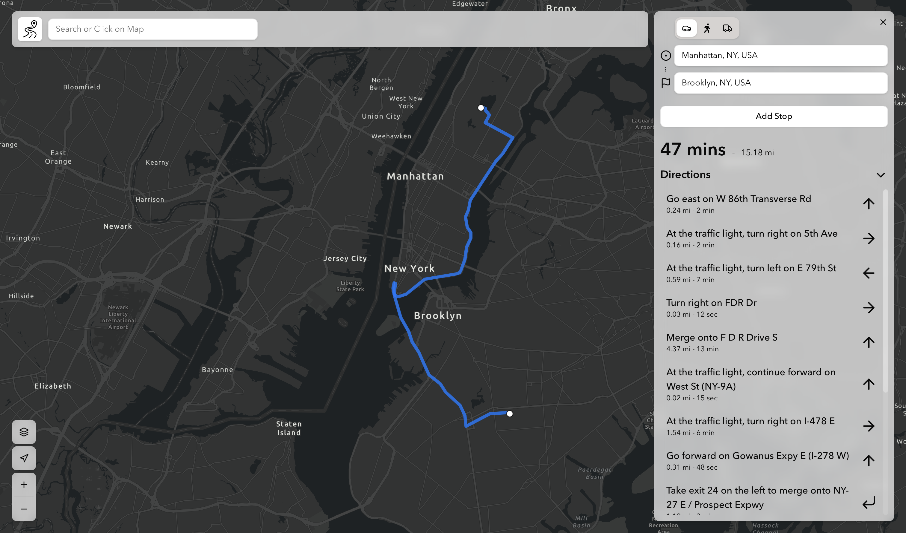
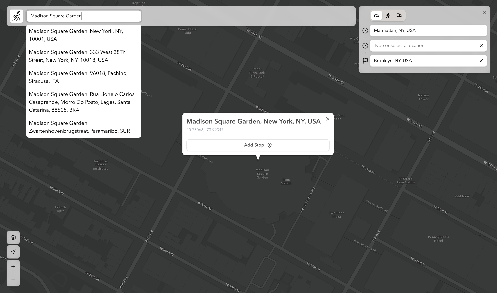
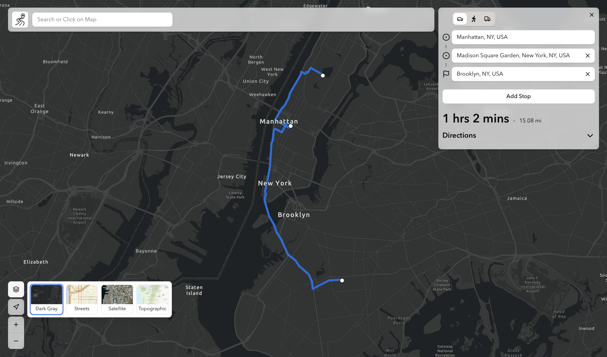
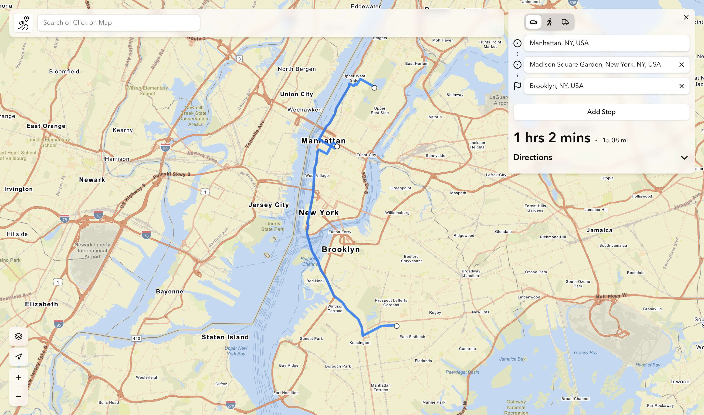

# [Routing App](https://Illyaluntik.github.io/routing-app)

Routing application to search for places and plan detailed routes with multiple stops.
Built with React, Vite, TypeScript, Tailwind, Schadcn, and ArcGIS API for JavaScript.


<div style="display: flex; gap: 5px;">
  
  
  
</div>

---

<p align="center">
  <a href="https://Illyaluntik.github.io/routing-app" target="_blank">
    
  </a>
</p>

## Features

- 🔍 **Search & Autocomplete** – find locations using ArcGIS geocoding.
- 📍 **Add & Manage Stops** – add, edit, reorder, and remove stops dynamically.
- 🛣️ **Route Solver** – compute routes with support for multiple travel modes.
- 📑 **Route Summary** – display total distance, duration, and step-by-step directions.
- 🖱️ **Popups on Map Click** – inspect clicked locations and create routes easily.
- 🧭 **User Geolocation** – detect and zoom to your current location on the map.

## Getting Started

Clone the repository and run locally:

```bash
git clone https://github.com/Illyaluntik/routing-app.git
cd routing-app
npm install
npm run dev
```

## Tech Stack

- [React 19](https://react.dev/) + [Vite](https://vitejs.dev/)
- [TypeScript](https://www.typescriptlang.org/)
- [Tailwind CSS](https://tailwindcss.com/) + [shadcn/ui](https://ui.shadcn.com/)
- [ArcGIS Maps SDK for JavaScript](https://developers.arcgis.com/javascript/)
